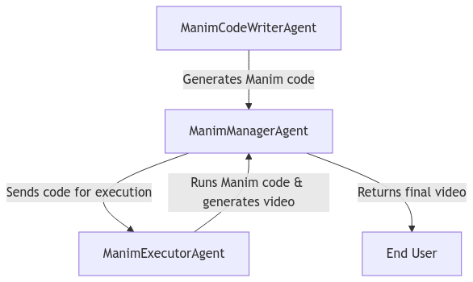

# **Manya**: Multi Agent AI Manim Generator

**Abstract**: **Manya** is a multi-agent AI system leveraging SmolAgents and Qwen to automate the generation of Manim animations. The system comprises specialized agents for code generation, debugging, execution, and optimization, streamlining the creation of high-quality educational visualizations. By integrating intelligent task delegation and iterative refinement, it enhances efficiency and accuracy in producing complex mathematical and scientific animations.


## Installation

Follow these steps to set up the project:

1. **Clone the Repository**: Run `git clone https://github.com/nihilisticneuralnet/Manya.git` to clone the repository to your local machine.

2. **Install Dependencies**: Navigate to the project directory and install the required packages by running `cd <repository-directory>` followed by `pip install -r requirements.txt`. 

3. **Set Up Environment Variables**: In the `.env` file in the project root directory and insert your Gemini and Sarvam API keys as follows:
   ```plaintext
   HF_TOKEN= "<huggingface_token>"
   ```
   Replace `<huggingface_token>` with your actual API key.

4. **Run the Application**: Finally, run the application using Streamlit by executing `python -m streamlit run app.py`.

Ensure you have all the necessary libraries installed before running these commands.

*See [examples](https://github.com/nihilisticneuralnet/Manya/tree/main/examples) for working in a Python notebook.*


## Workflow

<p align="center">
  
</p>


## Example Outputs:

#### Double-Slit Experiment

**Input:** Illustrate the double-slit experiment, demonstrating wave-particle duality and interference patterns

https://github.com/user-attachments/assets/6826b0fb-72b9-4917-b4a7-8e2e66bf992d


#### Binary Search Algorithm

**Input:** Explain how a binary search algorithm works with a sorted array

https://github.com/user-attachments/assets/d4d0a300-8690-4d21-ab99-4ab1d4860979

https://github.com/user-attachments/assets/5a2c4a36-2258-4de4-bd11-f9b57b852e43


#### Djikstra Algorithm

**Input:** Demonstrate Dijkstra's algorithm for finding the shortest path in a weighted graph

https://github.com/user-attachments/assets/8599983d-4515-43fc-90af-8d4cee5a6ab0


#### Pythogorean Theorem

**Input:** Show the proof of the Pythagorean theorem using area visualization

https://github.com/user-attachments/assets/7e5ac5bb-265e-43e0-99bd-8512b17d6cba


#### Normal Distribution

**Input:** Explain the concept of normal distribution with visual representation of mean, standard deviation, and the 68-95-99.7 rule

https://github.com/user-attachments/assets/1c641190-8129-47c1-97d6-8b79be0f6cef


#### Fibonacci Sequence

**Input:** Visualize the recursive calls in the Fibonacci sequence calculation, showing the call stack and how values are computed

https://github.com/user-attachments/assets/d57df3b5-60a6-48c3-a1e7-c61107072dfa


## Next Steps

- Model Upgrade: Replace Qwen with GPT-4o using frameworks like AutoGen, Crew, SambaNova, or Together AI.
- Prompt-Tuning: Optimize LLM responses through prompt engineering and fine-tuning techniques.
- Frontend/Backend Development: Move beyond Streamlit for better scalability and UI/UX design.
- LLM Fine-Tuning: Train the model specifically on Manim-related tasks to improve accuracy and quality of generated animations.

## References

- https://github.com/LilySu/MathMatrixMovies/blob/main/fine-tune/dataset.jsonl
- https://huggingface.co/spaces/HyperCluster/manimator/blob/main/manimator/main.py
