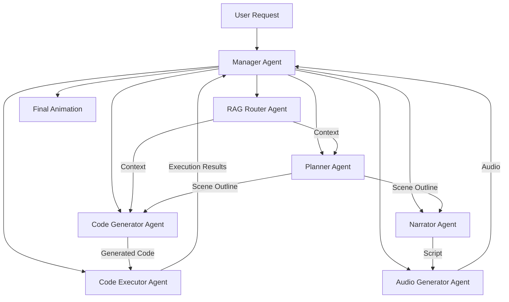

# Manya: Multi-Agent AI Manim Generation System

A multi-agent system that generates educational animations using 3Blue1Brown's [Manim](https://www.manim.community/).


## Architecture


```mermaid
graph TD
    A[User Request] --> B[Manager Agent]
    B --> C[RAG Router Agent]
    B --> D[Planner Agent]
    B --> E[Code Generator Agent]
    B --> F[Code Executor Agent]
    B --> G[Narrator Agent]
    B --> H[Audio Generator Agent]
    
    C --> |Context| D
    C --> |Context| E
    D --> |Scene Outline| E
    D --> |Scene Outline| G
    E --> |Generated Code| F
    F --> |Execution Results| B
    G --> |Script| H
    H --> |Audio| B
    
    B --> I[Final Animation]
```


## Installation

### Setup

```bash
# Clone the repository
git clone https://github.com/nihilisticneuralnet/Manya.git
cd Manya

# Install dependencies
pip install -r requirements.txt

# Insert your API keys
export GROQ_API_KEY="your_groq_api_key_here"
export SARVAM_API_KEY="your_sarvam_api_key_here"

# Run tests
cd src
python main.py
```

or you can refer to [notebook](https://github.com/nihilisticneuralnet/Manya/blob/main/manya_example.ipynb)


## Configuration

### Animation Parameters

| Parameter | Type | Default | Description |
|-----------|------|---------|-------------|
| `description` | str | Required | Natural language description of the animation |
| `duration` | int | 10 | Duration in seconds |
| `style` | str | "educational" | Animation style (educational, presentation, etc.) |
| `complexity` | str | "medium" | Complexity level (simple, medium, complex) |


## Results

**Prompt: Expand (a+b)^2 without using any squares**

https://github.com/user-attachments/assets/3b2a6c12-e2af-472f-b346-f93b278de2b6


## References

- [TheoremExplainAgent: Towards Multimodal Explanations for LLM Theorem Understanding](https://arxiv.org/abs/2502.19400v1)
