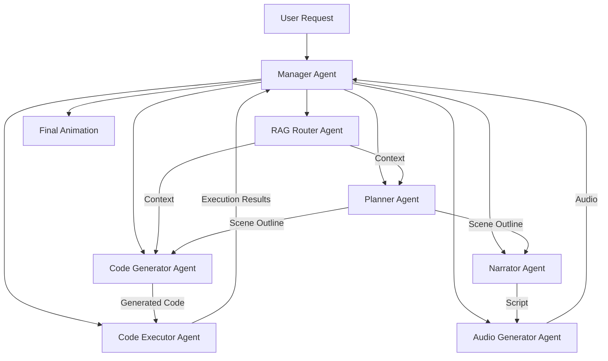

# Manya: Multi-Agent AI Manim Generator

A multi-agent system that generates educational animations using 3Blue1Brown's [Manim](https://www.manim.community/).


## 🏗️ System Architecture


```mermaid
graph TD
    A[User Request] --> B[Manager Agent]
    B --> C[RAG Router Agent]
    B --> D[Planner Agent]
    B --> E[Code Generator Agent]
    B --> F[Code Executor Agent]
    B --> G[Narrator Agent]
    B --> H[Audio Generator Agent]
    
    C --> |Context| D
    C --> |Context| E
    D --> |Scene Outline| E
    D --> |Scene Outline| G
    E --> |Generated Code| F
    F --> |Execution Results| B
    G --> |Script| H
    H --> |Audio| B
    
    B --> I[Final Animation]
```


### 4. Advanced Usage

```python
from manya import create_custom_animation

# Create a custom animation with specific parameters
results = create_custom_animation(
    groq_api_key="your_key_here",
    description="Animate the expansion of (a+b)²",
    duration=20,
    sarvam_api_key="your_sarvam_key",  # Optional
    output_dir="./my_animations"
)
```

## 📚 Usage Examples

### Mathematical Concepts
```python
# Algebra
pipeline.create_animation("Solve quadratic equations using the quadratic formula", duration=25)

# Calculus
pipeline.create_animation("Visualize the derivative as the slope of a tangent line", duration=30)

# Geometry
pipeline.create_animation("Prove that the angles in a triangle sum to 180 degrees", duration=20)
```

### Science Topics
```python
# Physics
pipeline.create_animation("Explain Newton's laws of motion with examples", duration=35)

# Chemistry
pipeline.create_animation("Show how ionic bonds form between atoms", duration=25)

# Biology
pipeline.create_animation("Illustrate the process of mitosis", duration=40)
```

## 🔧 Configuration

### Animation Parameters

| Parameter | Type | Default | Description |
|-----------|------|---------|-------------|
| `description` | str | Required | Natural language description of the animation |
| `duration` | int | 10 | Duration in seconds |
| `style` | str | "educational" | Animation style (educational, presentation, etc.) |
| `complexity` | str | "medium" | Complexity level (simple, medium, complex) |


## 📁 Output Structure

```
output/
├── output_SceneName.mp4      # Generated Manim animation
├── narration.wav             # Generated audio (if enabled)
├── final_animation.mp4       # Combined audio + video
└── scene.py                  # Generated Manim code
```


## Installation

### Setup

```bash
# Clone the repository
git clone https://github.com/nihilisticneuralnet/Manya.git
cd Manya/src

# Install dependencies
pip install -r requirements.txt

# Run tests
python main.py
```
or you can refer to examplefile
GROQ_API_KEY="your_groq_api_key_here"
SARVAM_API_KEY="your_sarvam_api_key_here"

## 📄 License

This project is licensed under the MIT License - see the [LICENSE](LICENSE) file for details.


## References

- [TheoremExplainAgent: Towards Multimodal Explanations for LLM Theorem Understanding](https://arxiv.org/abs/2502.19400v1)
