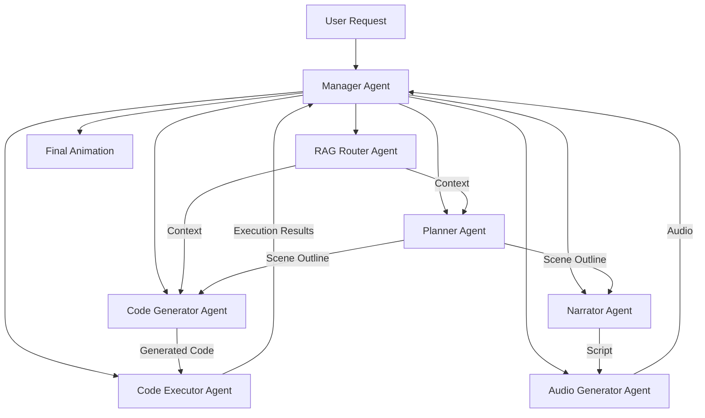

# Manya: Multi-Agent AI Manim Generator

A multi-agent system that generates educational animations using 3Blue1Brown's [Manim](https://www.manim.community/).

## Features

### Multi-Agent Architecture
- **Manager Agent**: Orchestrates the entire animation pipeline
- **RAG Router Agent**: Provides relevant Manim documentation context
- **Planner Agent**: Creates detailed scene outlines and storyboards
- **Code Generator Agent**: Generates and debugs Manim Python code
- **Code Executor Agent**: Executes code with iterative error fixing
- **Narrator Agent**: Creates engaging narration scripts
- **Audio Generator Agent**: Converts text to speech and combines with video

### 🚀 Key Capabilities
- **Intelligent Scene Planning**: Breaks down complex topics into structured visual sequences
- **Automated Code Generation**: Creates clean, executable Manim code from natural language descriptions
- **Iterative Debugging**: Automatically fixes code errors through intelligent analysis
- **RAG-Enhanced Context**: Uses Manim documentation for accurate code generation
- **Audio Narration**: Optional text-to-speech integration for complete educational videos
- **Error Recovery**: Robust error handling with multiple debugging attempts

## 🏗️ System Architecture


```mermaid
graph TD
    A[User Request] --> B[Manager Agent]
    B --> C[RAG Router Agent]
    B --> D[Planner Agent]
    B --> E[Code Generator Agent]
    B --> F[Code Executor Agent]
    B --> G[Narrator Agent]
    B --> H[Audio Generator Agent]
    
    C --> |Context| D
    C --> |Context| E
    D --> |Scene Outline| E
    D --> |Scene Outline| G
    E --> |Generated Code| F
    F --> |Execution Results| B
    G --> |Script| H
    H --> |Audio| B
    
    B --> I[Final Animation]
```

## 📋 Prerequisites

### Required Dependencies
```bash
# Core dependencies
pip install manim
pip install langchain
pip install langchain-groq
pip install langchain-community
pip install faiss-cpu
pip install sentence-transformers
```

### Optional Dependencies
```bash
# For audio generation (optional)
pip install sarvam-ai
pip install ffmpeg-python
```

### System Requirements
- Python 3.8+
- FFmpeg (for video processing)
- LaTeX (for mathematical expressions in Manim)
- GROQ API Key (required)
- Sarvam AI API Key (optional, for audio generation)

## 🚀 Quick Start

### 1. Installation

```bash
# Clone the repository
git clone https://github.com/yourusername/manya.git
cd manya

# Install dependencies
pip install -r requirements.txt

# Install Manim (if not already installed)
pip install manim
```

### 2. Set Up API Keys

```bash
# Set your GROQ API key (required)
export GROQ_API_KEY="your_groq_api_key_here"

# Set your Sarvam AI API key (optional, for audio)
export SARVAM_API_KEY="your_sarvam_api_key_here"
```

### 3. Basic Usage

```python
from manya import AnimationPipeline

# Initialize the pipeline
pipeline = AnimationPipeline(
    groq_api_key="your_groq_api_key",
    sarvam_api_key="your_sarvam_api_key",  # Optional
    output_dir="./output"
)

# Create an animation
results = pipeline.create_animation(
    description="Explain the Pythagorean theorem with visual proof",
    duration=30,
    style="educational",
    complexity="medium"
)

# Check results
print(f"Animation created: {results['summary']}")
```

### 4. Advanced Usage

```python
from manya import create_custom_animation

# Create a custom animation with specific parameters
results = create_custom_animation(
    groq_api_key="your_key_here",
    description="Animate the expansion of (a+b)²",
    duration=20,
    sarvam_api_key="your_sarvam_key",  # Optional
    output_dir="./my_animations"
)
```

## 📚 Usage Examples

### Mathematical Concepts
```python
# Algebra
pipeline.create_animation("Solve quadratic equations using the quadratic formula", duration=25)

# Calculus
pipeline.create_animation("Visualize the derivative as the slope of a tangent line", duration=30)

# Geometry
pipeline.create_animation("Prove that the angles in a triangle sum to 180 degrees", duration=20)
```

### Science Topics
```python
# Physics
pipeline.create_animation("Explain Newton's laws of motion with examples", duration=35)

# Chemistry
pipeline.create_animation("Show how ionic bonds form between atoms", duration=25)

# Biology
pipeline.create_animation("Illustrate the process of mitosis", duration=40)
```

## 🔧 Configuration

### Animation Parameters

| Parameter | Type | Default | Description |
|-----------|------|---------|-------------|
| `description` | str | Required | Natural language description of the animation |
| `duration` | int | 10 | Duration in seconds |
| `style` | str | "educational" | Animation style (educational, presentation, etc.) |
| `complexity` | str | "medium" | Complexity level (simple, medium, complex) |

### Agent Configuration

Each agent can be customized with specific parameters:

```python
# Custom RAG configuration
rag_agent = RAGRouterAgent(llm)
rag_agent.setup_embeddings()  # Uses sentence-transformers

# Custom code generation settings
code_generator = CodeGeneratorAgent(llm, rag_agent)
code_generator.max_iterations = 5  # Maximum debugging attempts
```

## 🏃‍♂️ Pipeline Workflow

### Step-by-Step Process

1. **Scene Planning** 🎬
   - Analyzes the input description
   - Creates structured scene outlines
   - Defines visual elements and timing

2. **Code Generation** 💻
   - Generates Manim Python code
   - Uses RAG for context-aware coding
   - Implements proper Manim syntax

3. **Code Execution** 🎯
   - Executes generated code
   - Iterative debugging if errors occur
   - Validates output video generation

4. **Narration Creation** 🎙️
   - Generates educational script
   - Matches narration to visual timing
   - Creates engaging educational content

5. **Audio Generation** 🔊 (Optional)
   - Converts script to speech
   - Combines audio with video
   - Produces final multimedia content

## 🛠️ Debugging and Error Handling

Manya includes sophisticated error handling:

### Automatic Error Detection
- **Syntax Errors**: Python syntax issues
- **Indentation Errors**: Python formatting problems
- **Import Errors**: Missing dependencies
- **Manim-Specific Errors**: Animation-related issues
- **Runtime Errors**: Execution problems

### Iterative Debugging Process
```python
# The system automatically:
# 1. Detects error type
# 2. Applies appropriate fixes
# 3. Re-executes code
# 4. Repeats up to max_iterations
# 5. Provides detailed error reports
```

## 📁 Output Structure

```
output/
├── output_SceneName.mp4      # Generated Manim animation
├── narration.wav             # Generated audio (if enabled)
├── final_animation.mp4       # Combined audio + video
└── scene.py                  # Generated Manim code
```

## 🤝 Contributing

We welcome contributions! Please see our [Contributing Guidelines](CONTRIBUTING.md) for details.

### Development Setup

```bash
# Clone the repository
git clone https://github.com/yourusername/manya.git
cd manya

# Create virtual environment
python -m venv manya-env
source manya-env/bin/activate

# Install development dependencies
pip install -r requirements-dev.txt

# Run tests
python -m pytest tests/
```

### Areas for Contribution
- Additional animation styles and templates
- New agent implementations
- Enhanced error handling
- Performance optimizations
- Documentation improvements

## 📊 Performance

### Typical Processing Times
- **Simple animations** (10-15 seconds): 2-3 minutes
- **Medium complexity** (20-30 seconds): 4-6 minutes
- **Complex animations** (30+ seconds): 6-10 minutes

### Resource Requirements
- **RAM**: 4GB minimum, 8GB recommended
- **CPU**: Multi-core processor recommended
- **Storage**: 1GB free space for outputs
- **Network**: Required for API calls

## 🔍 Troubleshooting

### Common Issues

1. **"Scene class not found"**
   - Ensure proper class definition in generated code
   - Check that class inherits from Scene

2. **"FFmpeg not found"**
   - Install FFmpeg: `conda install ffmpeg` or system package manager

3. **"API rate limit exceeded"**
   - Check your GROQ API usage limits
   - Implement delays between requests

4. **"LaTeX compilation failed"**
   - Install LaTeX distribution (TeX Live, MiKTeX)
   - Check mathematical expressions syntax

### Debug Mode

```python
import logging
logging.basicConfig(level=logging.DEBUG)

# This will provide detailed logs of the generation process
pipeline.create_animation("your description here")
```

## 📄 License

This project is licensed under the MIT License - see the [LICENSE](LICENSE) file for details.

## 🙏 Acknowledgments

- [Manim Community](https://www.manim.community/) for the excellent animation engine
- [LangChain](https://langchain.com/) for the multi-agent framework
- [GROQ](https://groq.com/) for fast LLM inference
- [Sarvam AI](https://sarvam.ai/) for text-to-speech capabilities

## 📞 Support

- **Documentation**: [Link to docs]
- **Issues**: [GitHub Issues](https://github.com/yourusername/manya/issues)
- **Discussions**: [GitHub Discussions](https://github.com/yourusername/manya/discussions)
- **Email**: support@manya-ai.com

## 🚧 Roadmap

### Version 2.0 (Planned)
- [ ] Support for 3D animations
- [ ] Interactive web interface
- [ ] Batch processing capabilities
- [ ] Cloud deployment options
- [ ] Additional TTS providers
- [ ] Custom animation templates

### Version 1.5 (In Progress)
- [ ] Improved error handling
- [ ] Performance optimizations
- [ ] Extended RAG knowledge base
- [ ] Multi-language support

---

**Made with ❤️ by the Manya Team**

*Transform your ideas into beautiful educational animations with the power of AI!*
